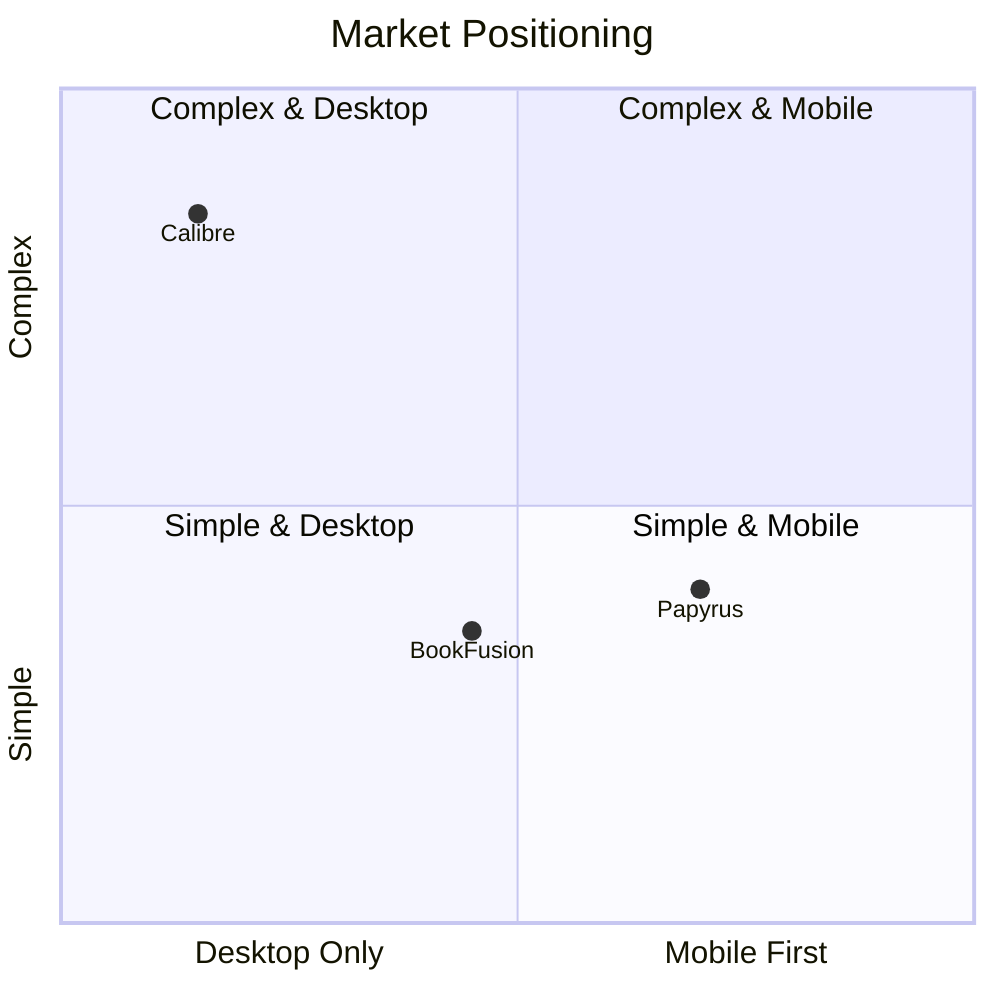

# Market analysis

This section provides market research, competitive analysis, and positioning strategy for Papyrus.

## Executive summary

Papyrus enters the e-book management market with a focus on **user data ownership**, **cross-platform consistency**, and **privacy-first design**. Unlike existing solutions that lock users into ecosystems or require subscriptions, Papyrus provides a free, open-source alternative that respects user privacy and works across all devices.

---

## Target audience

### Primary users

**1. Avid digital readers**

- Read 10+ books per year
- Use multiple devices (phone, tablet, e-reader, computer)
- Frustrated with ecosystem lock-in (Kindle, Kobo)
- Want to own their book files

**2. Privacy-conscious users**

- Prefer local-first applications
- Avoid cloud services with tracking
- Want control over their data
- May self-host services

**3. E-ink device owners**

- Use dedicated e-readers (Kobo, Boox, etc.)
- Want a unified library across devices
- Need optimized reading experience
- Value battery efficiency

**4. Organized readers**

- Large book collections (500+ books)
- Need powerful organization tools
- Track reading progress and habits
- Set and achieve reading goals

### Secondary users

**5. Students and researchers**

- Heavy annotation and note-taking
- Need to export highlights
- Organize by topics/courses
- Reference and citation needs

**6. Book clubs**

- Shared reading lists
- Discussion coordination
- Progress tracking

---

## Competitive landscape

### Direct competitors

| Product | Strengths | Weaknesses |
|---------|-----------|------------|
| **Calibre** | Powerful, free, open-source | Complex UI, desktop-only, steep learning curve |
| **BookFusion** | Cross-platform, good UI | Subscription required, cloud-dependent |
| **Moon+ Reader** | Feature-rich Android app | Android-only, no sync |
| **KOReader** | Open-source, e-ink optimized | Limited platforms, technical setup |

### Ecosystem players

| Platform | Lock-in | Cross-platform | Notes |
|----------|---------|----------------|-------|
| **Amazon Kindle** | High | Yes (apps) | Proprietary format, tracking |
| **Apple Books** | High | Apple only | No export, iOS/macOS only |
| **Google Play Books** | Medium | Yes | Cloud-only, limited features |
| **Kobo** | Medium | Limited | Better DRM-free support |

### Feature comparison

| Feature | Papyrus | Calibre | BookFusion | Kindle |
|---------|---------|---------|------------|--------|
| Cross-platform | Yes | Desktop only | Yes | Yes |
| Offline-first | Yes | Yes | No | Partial |
| Open source | Yes | Yes | No | No |
| Self-hostable | Yes | N/A | No | No |
| E-ink optimized | Yes | No | No | Yes |
| No subscription | Yes | Yes | No | Yes |
| Privacy-first | Yes | Yes | No | No |
| Format conversion | Yes | Yes | Limited | No |
| Annotations export | Yes | Yes | Yes | Limited |
| Reading stats | Yes | Limited | Yes | Yes |

---

## Market opportunities

### Gap analysis

**1. Unified cross-platform experience**

- Most solutions are platform-specific or web-only
- Users want consistent experience across all devices
- Opportunity: Single app for Android, iOS, Web, Desktop, E-ink

**2. Privacy and data ownership**

- Growing concern about data tracking
- Users want control over their reading data
- Opportunity: Local-first with optional self-hosted sync

**3. E-ink device support**

- Existing apps poorly optimized for e-ink
- E-ink market growing (Boox, reMarkable, etc.)
- Opportunity: First-class e-ink support

**4. Open standards**

- Proprietary formats limit user freedom
- DRM frustrates legitimate users
- Opportunity: Focus on open formats (EPUB)

**5. Modern user experience**

- Calibre is powerful but dated UI
- Most alternatives are basic
- Opportunity: Modern, intuitive interface

### Market trends

- **E-reader growth**: E-ink device market expanding beyond Kindle
- **Privacy awareness**: Post-GDPR users care about data control
- **Self-hosting renaissance**: Growing interest in self-hosted services
- **Remote work**: More reading time, need for organization
- **Subscription fatigue**: Users resisting yet another subscription

---

## Positioning strategy

### Value proposition

> **Papyrus: Your books, your data, every device.**
>
> A free, open-source e-book manager that works everywhere you read. No subscriptions, no tracking, no lock-in.

### Key differentiators

1. **True cross-platform**: One app for all devices including e-ink
2. **Offline-first**: Full functionality without internet
3. **Privacy by default**: No analytics, no tracking
4. **Data ownership**: Export everything, self-host if desired
5. **Modern UX**: Clean, intuitive Material 3 design
6. **Open source**: Transparent, community-driven development

### Target positioning

**Positioning notes:**

- **Calibre**: Powerful but complex, desktop-only
- **BookFusion**: Cross-platform but subscription-based
- **Papyrus (target)**: Mobile-first, simple UX, cross-platform
